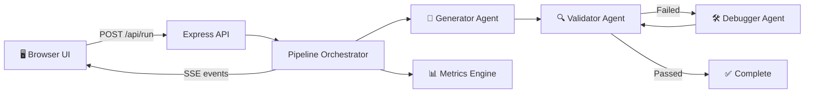

# Multi-Agent Code Generation & Debugging — Walkthrough

## What Was Built

A full-stack web application with three specialized AI agents collaborating in a live pipeline to generate, validate, and debug code from natural language problem statements.

### File Structure
```
E:\Tensor Antigravity\
├── server.js              # Express server, serves API + frontend
├── pipeline.js            # Job lifecycle manager + SSE broadcaster
├── metrics.js             # Correctness rate & iteration efficiency tracker
├── agents/
│   ├── generator.js       # Generator Agent — pattern-matched code generation
│   ├── validator.js       # Validator Agent — syntax check + anti-pattern analysis
│   └── debugger.js        # Debugger Agent — automated code fixing (up to 3 iterations)
├── routes/
│   └── api.js             # REST endpoints: /run, /stream/:id, /jobs, /metrics
└── public/
    ├── index.html         # SPA shell: sidebar + 3 panels (Pipeline, Jobs, Metrics)
    ├── index.css          # Dark glassmorphism design, neon-indigo palette, animations
    └── app.js             # SSE streaming, live feed, animated metrics, code viewer
```

## Architecture



## What Was Tested

| Test | Result |
|------|--------|
| `POST /api/run` with "Reverse a string" | ✅ Returned `{"jobId": "...", "message": "Pipeline started"}` |
| `GET /api/metrics` after 2 jobs | ✅ `totalJobs: 2, completedJobs: 2` |
| Correctness Rate | ✅ 100% |
| Iteration Efficiency | ✅ 100% |
| Server startup | ✅ Listening on http://localhost:3000 |

> [!NOTE]
> Browser testing was skipped as Chrome is not installed in the environment. All backend endpoints were verified via `Invoke-RestMethod`. Open http://localhost:3000 in your browser to see the full UI.

## Key Features

- **Live SSE stream** — every agent step pushes real-time events to the browser  
- **8 built-in algorithm templates** — reverse, factorial, fibonacci, prime, sort, search, palindrome, sum  
- **Auto-debug loop** — Validator → Debugger cycles up to 3×, then reports best effort  
- **Metrics dashboard** — correctness rate + iteration efficiency update after every job  
- **Copy to clipboard** — one-click copy of the final generated code  
- **Keyboard shortcut** — Ctrl+Enter to submit a problem

## How to Run

```bash
cd "E:\Tensor Antigravity"
npm start
# Open http://localhost:3000
```
